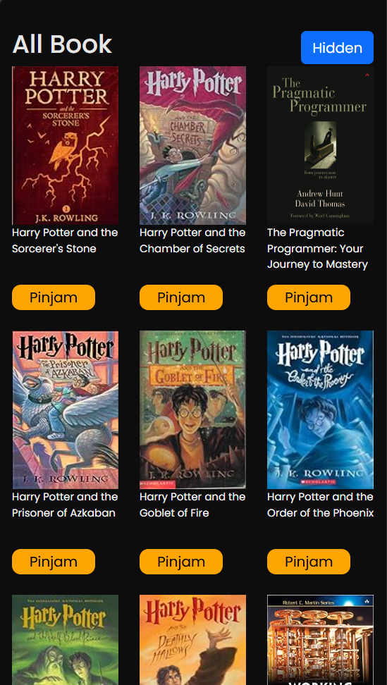
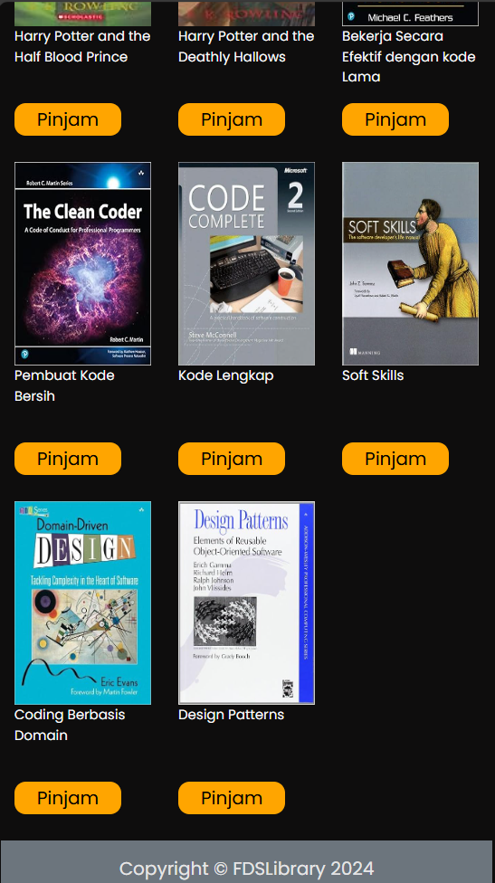

# Nama Proyek
Website untuk melakukan peminjaman buku online pada perpustakaan.

## 📸 Tampilan Proyek
1. 

## 📸 Tampilan Pada Mobile
   
1. 
   
2. 
   
3. 

## 📌 Fitur
- ✅ Login
- ✅ Registrasi
- ✅ Peminjaman
- ✅ Admin CRUD
- ✅ Detail Buku

## 🛠️ Teknologi yang Digunakan
- **Frontend**: HTML, CSS, JavaScript  
- **Backend**: PHP, MySQL  
- **Tools**: XAMPP, GitHub  

## 🚀 Cara Menjalankan Proyek
1. **Clone Repository**
   ```sh
   git clone https://github.com/USERNAME/REPO_NAME.git
2. **Import database Coffee**
3. **Jalankan pada localhost**

✨ Kontributor
- Faizal Dwi Saputra
